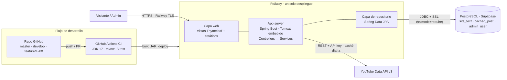
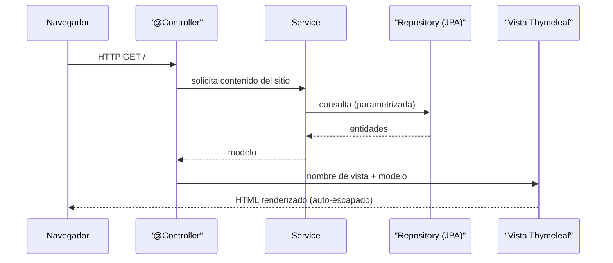

# Arquitectura

Sitio web de **Una Joven Evangelizando**: una landing pública tipo *scrollytelling*
que presenta a la creadora y agrega su contenido reciente de YouTube, más un panel
de administración protegido para editar textos y elegir el video destacado.

## Stack

| Capa | Tecnología |
|---|---|
| Lenguaje | Java 17 |
| Framework | Spring Boot 3.x |
| Build | Maven (con Maven Wrapper) |
| Web / MVC | Spring MVC con `@Controller` (renderizado en servidor, **no** REST para el sitio público) |
| Vista | Plantillas Thymeleaf |
| Persistencia | Spring Data JPA (Hibernate) |
| Base de datos | PostgreSQL (Supabase) |
| Servidor | Tomcat embebido |
| API externa | YouTube Data API v3 |
| Hosting | Railway |
| CI | GitHub Actions |

## Estilo arquitectónico: MVC en capas

El proyecto sigue una organización **por capas** bajo el paquete raíz `com.ujeva`:

- **controller** — recibe peticiones HTTP, invoca servicios y devuelve nombres de
  vista. Solo orquestación HTTP y selección de vista.
- **service** — lógica de negocio: contenido del sitio, resolución del video
  destacado, integración con YouTube y caché.
- **repository** — interfaces Spring Data JPA.
- **model** — entidades JPA (`SiteText`, `CachedPost`, `AdminUser`).
- **config / util** — seguridad, sembrado inicial y utilidades.

## Vista de componentes y despliegue

## Flujo de una petición MVC

## Modelo de datos

| Entidad / tabla | Columnas | Claves / índices | Notas |
|---|---|---|---|
| `SiteText` / `site_text` | `id` PK, `content_key` (único, not null), `content_value` TEXT, `updated_at` | unique(`content_key`) | 2 claves editables: `heroLema` y `heroPresentacion`. |
| `CachedPost` / `cached_post` | `id` PK, `video_id` (único, not null), `platform`, `type` (`RECENT`/`FEATURED`/`PRAYER`), `title`, `meta`, `thumbnail_url`, `published_at`, `sort_order`, `fetched_at` | unique(`video_id`), idx(`published_at DESC`), idx(`type`) | El scheduler hace upsert/prune **solo de las filas `RECENT`**; las `FEATURED` y `PRAYER` las administra la creadora desde el panel y el scheduler nunca las toca. Su orden lo fija `sort_order`. |
| `AdminUser` / `admin_user` | `id` PK, `username` (único, not null), `password_hash`, `enabled`, `role` | unique(`username`) | Hash BCrypt. El usuario inicial se siembra desde `ADMIN_INITIAL_USERNAME` / `ADMIN_INITIAL_PASSWORD`. |

- `@GeneratedValue(IDENTITY)` (BIGSERIAL en PostgreSQL).
- `ddl-auto=update` en desarrollo → `validate` antes de GA.
- Filas por defecto y usuario admin sembrados de forma idempotente vía
  `CommandLineRunner` cuando las tablas están vacías.

## Seguridad (mapa a requerimientos)

- **RA-01** — contraseñas con `BCryptPasswordEncoder`; solo se almacena el hash.
- **RA-02** — `SecurityFilterChain`: `/admin/**` autenticado; `/`, `/acerca`,
  `/admin/login` y estáticos con `permitAll`; anónimo en `/admin` → redirección a
  login; logout.
- **RA-03** — Bean Validation y topes de longitud en el DTO de contenido; consultas
  parametrizadas de Spring Data (SQLi); auto-escapado de Thymeleaf (`th:text`) en
  todo dato de usuario (nunca `th:utext`).
- **RI-04** — TLS de Railway + `server.forward-headers-strategy=framework`.
- **Secretos** — solo por variables de entorno; `sslmode=require`; `.env` ignorado
  por git.
- **CSRF** — habilitado; el autoguardado del panel envía el token vía *meta tag*.

## Milestones

- **Beta** — todo corriendo end-to-end en local: BD, modelo, landing responsiva,
  integración YouTube, agregador y panel admin con seguridad.
- **GA** — producción: HTTPS en Railway, dominio propio, backups de Supabase
  verificados y documentación completa.

Ver [decisiones-arquitectura.md](decisiones-arquitectura.md) para las decisiones
(ADR) que fijan el comportamiento de producción frente al prototipo de diseño.
